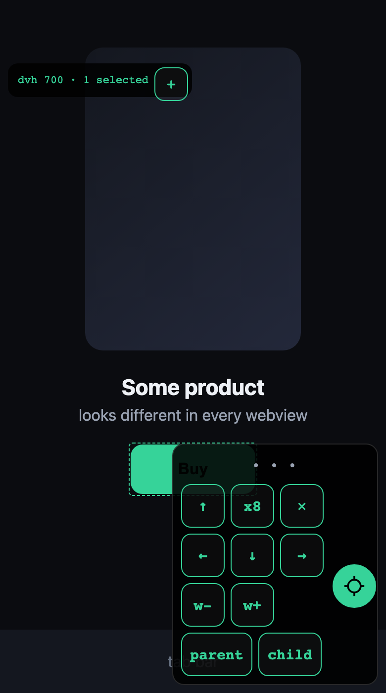

# webview-tuner

  


Layout forensics and live element nudging for webviews you can't inspect - wallet
in-app browsers (Phantom, Solflare, Jupiter, Backpack), TWAs, release-build
WKWebView/Chromium views.

## The problem

Your dApp looks perfect in Chrome DevTools and broken inside a wallet's in-app
browser. Release builds don't allow remote inspection, so you can't see what the
webview sees: its viewport height, its safe-area insets, why your CTA floats
mid-screen. You end up guessing constants, deploying, asking someone with the
device "is it better now?", and repeating.

Built while shipping [portfi](https://portfi.fun) packs - the buy screen looked
fine on mobile Chrome and broke in three different wallet webviews, each
reporting a different `100dvh`.

<p align="center">
  
</p>

## What it does

Add one script. Open your page inside the actual webview with `?wvtune=1`.

- **Metrics panel**: real viewport size, `dvh` / `svh` / `lvh` as the webview
  resolves them, `safe-area-inset-bottom`, horizontal-overflow detector.
- **Inspect mode**: a floating ⌖ badge toggles it. While on, the page is
  inert and plain taps select elements (dashed ring + floating arrow pad
  next to the selection). Tap several elements to move them together -
  nudging a CTA never activates it.
- **Nudge live**: pad arrows move the selection by the pixel (`x8` for 8px
  steps, hardware arrows + Shift too), width steppers resize. Overrides use
  the CSS `translate` property, so they compose with existing transform
  animations instead of clobbering them.
- **Copy for AI**: one button copies a text report - metrics, a CSS selector
  path for the element, its box, the offsets you chose, URL and user agent.
  Paste it to Claude (or any assistant working on your code) and it knows
  exactly which element to move and by how many pixels.

No dependencies, one file, ~4 KB. Renders nothing unless the query param is
present, so it is safe to keep in production.

## Install

```html
<script src="webview-tuner.js"></script>
<!-- shows only when the page is opened with ?wvtune=1 -->
```

Or force it on regardless of the query string (for a dev build):

```html
<script src="webview-tuner.js" data-auto></script>
```

## Workflow

1. Deploy your page with the script (it stays dormant).
2. On the device, open the page inside the wallet browser with `?wvtune=1`.
3. Read the metrics - usually the bug is already visible ("dvh is 850 here,
   not the 660 I designed for").
4. Tap the ⌖ badge, tap the misplaced element -> nudge until it looks right.
5. `copy` -> paste the report into your AI pair programmer -> it turns your
   on-device pixels into the real CSS fix.

## Report example

```
440x746  outer 746  screen 956
vv 746  dvh 746  svh 746  lvh 746
safe-b 0  hscroll none
sel[0] div.buyCta > button.primary
  box 384x64 @ 28,562
  OVERRIDE dx 0 dy -14 dw 16
url https://yourapp.xyz/checkout?wvtune=1
ua ... JupiterBrowser/3.11.0 ...
```

## Use with your AI coding agent

`SKILL.md` in this repo is a plain-markdown skill: it teaches an agent the
full loop - wire the script into your project, tell the user what to do on the
device, and turn a pasted report into a real CSS fix (formula-level, not magic
constants). It works with any agent that can read a file.

**Claude Code** - loads it natively as a skill:

```bash
git clone https://github.com/4oko4ow/webview-tuner ~/.claude/skills/webview-tuner
```

Then just say "the page looks broken in the wallet browser" or paste a tuner
report in any project - the skill picks it up.

**Cursor** - add it as a project rule:

```bash
mkdir -p .cursor/rules && curl -o .cursor/rules/webview-tuner.mdc \
  https://raw.githubusercontent.com/4oko4ow/webview-tuner/main/SKILL.md
```

**Codex CLI / agents that read AGENTS.md** - vendor the file and point to it:

```bash
curl -o docs/webview-tuner-skill.md \
  https://raw.githubusercontent.com/4oko4ow/webview-tuner/main/SKILL.md
echo "When debugging webview layouts, follow docs/webview-tuner-skill.md" >> AGENTS.md
```

**Anything else (ChatGPT, a raw API agent, your own harness)** - paste the
contents of `SKILL.md` into the system context together with the user's
report. The report format is stable and documented there.

## License

MIT
